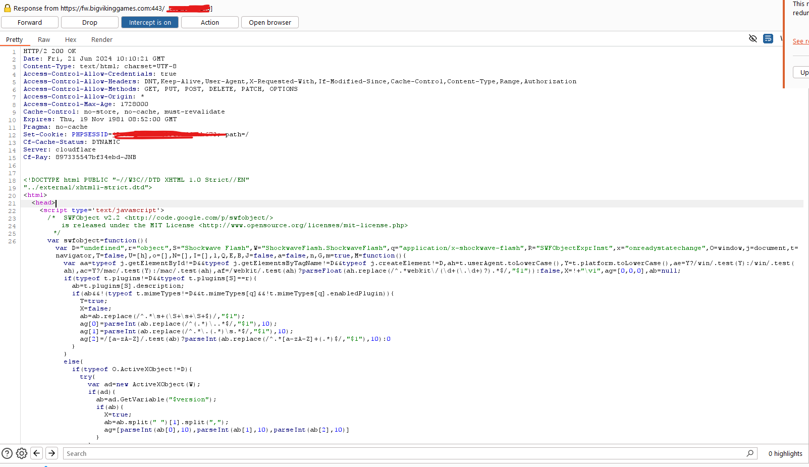
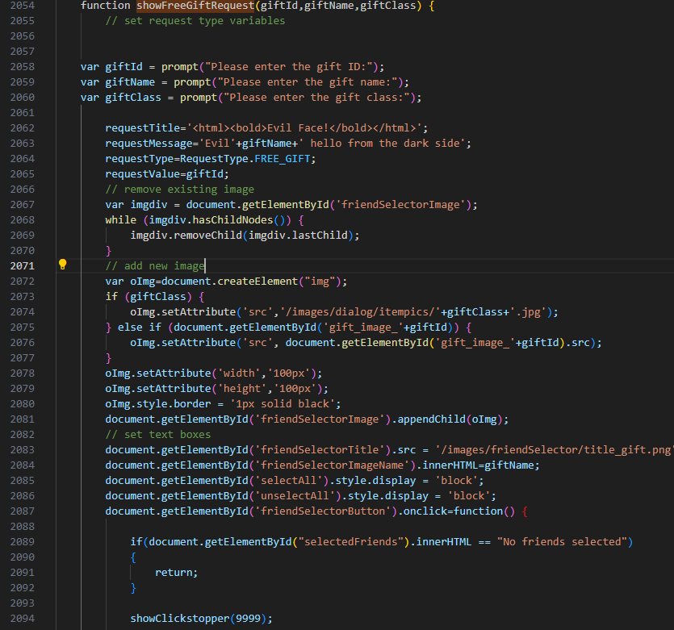
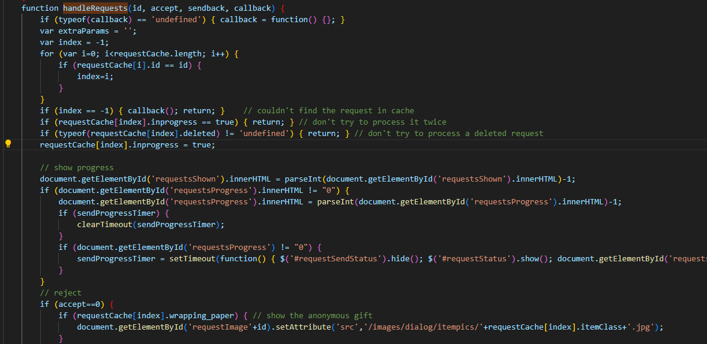
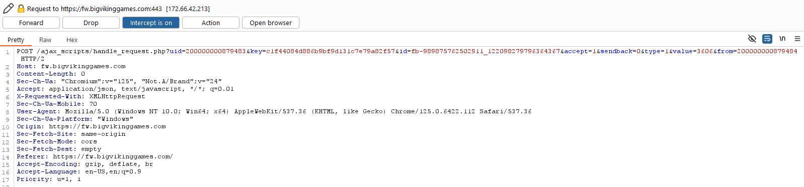
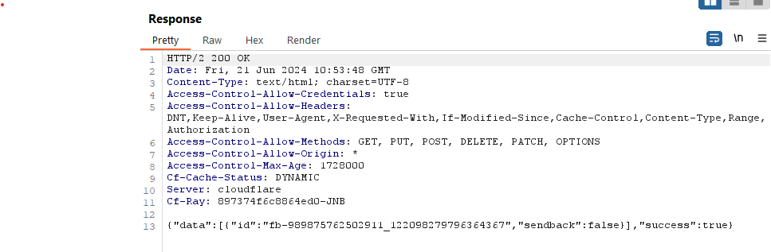
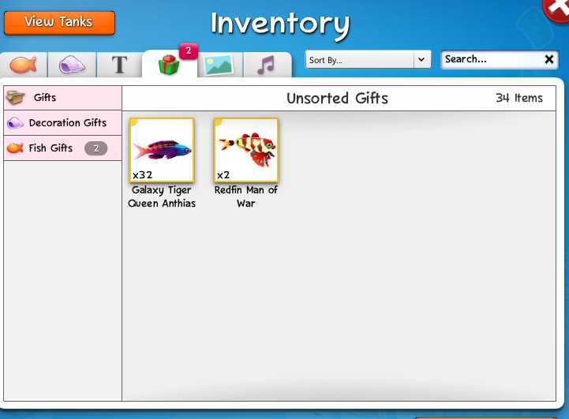

# Hacking_FishWorld
A blog
Please revise and edit github ReadMe :


An old friend of mine was telling me how he fell back into the now ancient Facebook game called Fishworld. 

I decided to see what he was on about and couldn't help but immediately start poking around at the internals.  

I started by hoping over to my favorite proxy tool BurpSuite and began stepping through some request and packets, immediately we can see the main game server is :

https://fw.bigvikinggames.com

This is a good start and allows use to set our interecption to be more specfic and avoid all those annoying facebook requests so we only see the good stuff !


 
Awesome ! Here we can see a large chunk of the fishworld JS code there is no doubt some juicy stuff in here. Let's take a stab a sending gifts.

A good few hours later of reading through the JavaScript code, I've come across an intresting section.

(I just copied the JS code from our interception in burpsuite to Vs code to make everything a little more legable)



This function is responsable for reading the items values of the free gift that we're attempting to send. It is basically a wrapper for this little API endpoint :

<pre>
```java
  $('#friendSelectorClose').attr('onclick','').unbind('click');
            $.ajax( {type:'POST', url: '/ajax_scripts/gift_send.php?check=2&uid='+userId+'&key='+loginKey, dataType: 'json'} )
                .done( function(response) {
                    if (typeof(response.success) == 'undefined') {
                        showError("There was an error sending your gifts, please try again later");
                    } else if ( response.success !== true) {
                        showError("There was an error sending your gifts, please try again later");
                    } else {
                        giftSendsRemaining = response.giftSendsRemaining;
                        decrementedFreeGifts=false;
                        if (giftSendsRemaining < 0 ) {
                            giftSendsRemaining = 0;
                            document.getElementById('giftSends').style.color = '#FF0000';
                            friendSelectorClose();
                        } else {
                            document.getElementById('giftSends').style.color = '#00FF00';
                            sendRequests();
                        }
                        document.getElementById('giftSends').innerHTML = giftSendsRemaining;
                        setGiftSendState();
                    }
                })
```
                        </pre>

This EndPoint won't be super useful to us but reversing and finding the inner ends points and understanding how the program acesses and use them is increibily important to abbusing them at all.

Digging further through the code, We find that the actual Free gifts are handled by the FaceBook.UI request, Honestly I had to do a bit of research on the old Facebook game SDK to figure out how exactly the diaglog request works but just to give you the TDLR :

FaceBook.UI(Request, UserID) -> Basically sends a Request to the passed Facebook UserID.

When we load into Fishworld and click on our gifts Tab Fishworld loads and parses all the FaceBook requests and loads them into a neat little list for us to Accept or Reject, The FaceBook request is also responsable for holding our gift values. 

So how do we abuse this? Well, we need to understand things better before we can really abuse things. Lets see how the game handles accepting gifts.



With more digging we've found this rather neat function named HandleRequests and from what I can tell this handles the acception or rejection of all gift types and internally just use a Case statement to switch between them all. 
After reading it more it all boils down to this end point :


<pre>
```java
                    $.ajax( {type:'POST', url: '/ajax_scripts/handle_request.php?uid='+userId+'&key='+loginKey+'&id='+id+'&accept=0', dataType: 'json'} )
                        .done( function(response) {
                            if (typeof(response.success) == 'undefined') {
                                showError("There was an error processing your request, please try again later");
                            } else if ( response.success !== true) {
                                if (response.msg == "Multiple logins detected") {
                                    showError("Your account is logged in somewhere else, please close this tab or reload the game");
                                } else if (response.msg == "Login key timeout") {
                                    showError("Your account Login Key has timed out, please reload the game.");
                                } else {
                                    showError("There was an error processing your request, please try again later");
                                }
                            }
                        })
```
</pre>


Just a further bit down in the same function we also see this sneaky bit of code :

<pre>
```java
            if (id.indexOf("_") !== -1) {   // delete facebook request
                var dashIndex = id.indexOf("-");
                var requestId = id.substr(dashIndex+1); //need to trim off the leading request prefix
                Facebook.api(requestId, 'delete', {access_token:fbAccessToken}, function(response) { });
            }
```
</pre>

Here we can see that the facebook Requests is deleted and removed from the que client side ! This is a big red flag, if our handle_request function doesn't check the facebook requests server side. We can just go ahead and call that end point over and over again accepting the same gift infinitely, lets test it out - We go into our gift requests tab in-game and turn on our burpsuite intereception once again :

 


Perfect this is looking promising, let's go ahead and send that request to our BurpSuite Repeater and try clam our gift over and over again !

 

Awsome we got a 200 OK ! this is looking really good so far lets spam this a few more times turn off our intereception and see if they gifts hit out inventory.

 

It worked!, We've sucessfully abused a vuneriable end point (and really poor design) in the game !
