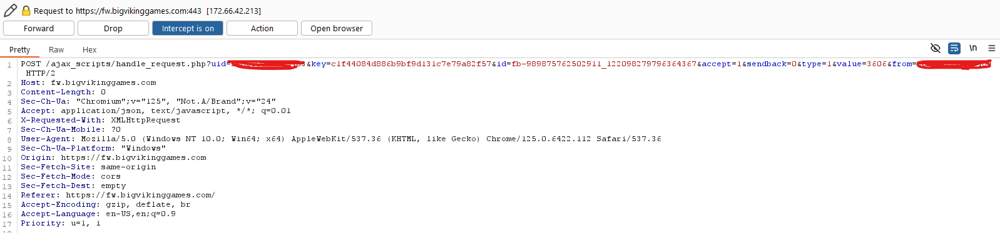

# Hacking_FishWorld Blog

## Introduction
This blog details my exploration into the ancient Facebook game Fishworld, prompted by a friend's nostalgic tale. Intrigued, I began delving into its internals, armed with tools like BurpSuite to dissect requests and packets.

## Game Server Discovery
I quickly identified the main game server: (https://fw.bigvikinggames.com). Focusing on this allowed me to streamline my intercepts, filtering out unnecessary Facebook requests to hone in on game-specific data.


## Exploring JavaScript
Digging into the intercepted JavaScript code revealed intriguing insights. Here's a snippet from our exploration:


> This function is responsible for reading the items values of the free gift that we're attempting to send. It is basically a wrapper for this little API endpoint:

```javascript
$('#friendSelectorClose').attr('onclick','').unbind('click');
$.ajax({
    type: 'POST',
    url: '/ajax_scripts/gift_send.php?check=2&uid='+userId+'&key='+loginKey,
    dataType: 'json'
}).done(function(response) {
    if (typeof(response.success) == 'undefined') {
        showError("There was an error sending your gifts, please try again later");
    } else if (response.success !== true) {
        showError("There was an error sending your gifts, please try again later");
    } else {
        giftSendsRemaining = response.giftSendsRemaining;
        decrementedFreeGifts=false;
        if (giftSendsRemaining < 0 ) {
            giftSendsRemaining = 0;
            document.getElementById('giftSends').style.color = '#FF0000';
            friendSelectorClose();
        } else {
            document.getElementById('giftSends').style.color = '#00FF00';
            sendRequests();
        }
        document.getElementById('giftSends').innerHTML = giftSendsRemaining;
        setGiftSendState();
    }
});
```

## Understanding Gift Handling

Further exploration led us to understand how gifts are managed using Facebook's UI requests. These requests handle the distribution and tracking of gifts within Fishworld.

With more digging we've found this rather neat function named HandleRequests and from what I can tell this handles the acceptance or rejection of all gift types and internally just uses a Case statement to switch between them all. After reading it more it all boils down to this endpoint:


```javascript
$.ajax({
    type: 'POST',
    url: '/ajax_scripts/handle_request.php?uid='+userId+'&key='+loginKey+'&id='+id+'&accept=0',
    dataType: 'json'
}).done(function(response) {
    if (typeof(response.success) == 'undefined') {
        showError("There was an error processing your request, please try again later");
    } else if (response.success !== true) {
        if (response.msg == "Multiple logins detected") {
            showError("Your account is logged in somewhere else, please close this tab or reload the game");
        } else if (response.msg == "Login key timeout") {
            showError("Your account Login Key has timed out, please reload the game.");
        } else {
            showError("There was an error processing your request, please try again later");
        }
    }
});
```

Just a further bit down in the same function we also see this sneaky bit of code:

```javascript
if (id.indexOf("_") !== -1) {   // delete Facebook request
    var dashIndex = id.indexOf("-");
    var requestId = id.substr(dashIndex+1); // need to trim off the leading request prefix
    Facebook.api(requestId, 'delete', {access_token: fbAccessToken}, function(response) { });
}
```

Here we can see that the facebook Requests is deleted and removed from the que, client side! This is a big red flag, if our handle_request function doesn't check the facebook requests server side. We can just go ahead and call that end point over and over again accepting the same gift infinitely, lets test it out - We go into our gift requests tab in-game and turn on our burpsuite intereception once again :

 

## Exploiting Vulnerabilities

Perfect this is looking promising, let's go ahead and send that request to our BurpSuite Repeater and try clam our gift over and over again !

 

Awesome we got a 200 OK ! this is looking really good so far lets spam this a few more times turn off our interception and see if they gifts hit out inventory.

 

It worked!, We've successfully abused a vulnerable end point (and really poor design) in the game !
